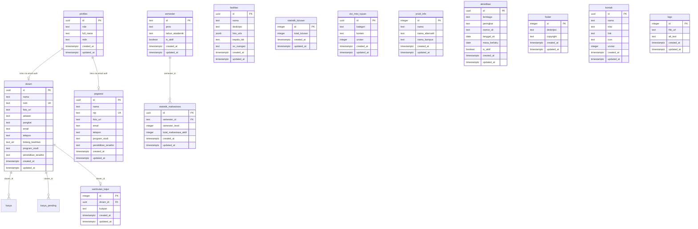

# Supabase Schema Refactoring Plan

## Overview

Refactor the existing Supabase schema to support new features: fasilitas, pegawai, semester-based statistics, visi/misi/tujuan, prodi info, akreditasi, footer/kontak, logo, and sambutan kajur. All tables get `created_at` + `updated_at`.

---

## Storage Bucket Structure

```
galeri/
├── fasilitas/
├── pengabdian/
├── publikasi-penelitian/
├── buku-ajar/
└── sertifikasi/
kurikulum/
dosen/
```

---

## Current Tables — Changes Needed

### `profiles` — ADD role option
- Add `'pegawai'` to allowed roles
- Add `created_at`

### `dosen` — ADD `updated_at`

### `galeri` — ADD `updated_at`

### `karya` / `karya_pending` — ADD `updated_at`

### `kurikulum_aktif` — ADD `created_at`, `updated_at`

### `mata_kuliah` — ADD `deskripsi`, `created_at`, `updated_at`

### `cpl` — ADD `created_at`, `updated_at`

### `statistik_mahasiswa` — **REPLACED** (see new table below)

---

## New Tables

### 1. `fasilitas`

| Column | Type | Nullable | Default | Notes |
|---|---|---|---|---|
| `id` | uuid | NO | `uuid_generate_v4()` | PK |
| `nama` | text | NO | — | Facility name |
| `deskripsi` | text | YES | — | Description |
| `foto_urls` | jsonb | YES | `'[]'::jsonb` | Array of URLs from `galeri/fasilitas/` |
| `kepala_lab` | text | YES | — | Lab head name |
| `no_ruangan` | text | YES | — | Room number |
| `created_at` | timestamptz | NO | `now()` | |
| `updated_at` | timestamptz | NO | `now()` | |

---

### 2. `pegawai`

Like `dosen` but without `jabatan`, `pangkat`, `bidang_keahlian`. Uses `nip` instead of `nidn`.

| Column | Type | Nullable | Default | Notes |
|---|---|---|---|---|
| `id` | uuid | NO | `uuid_generate_v4()` | PK |
| `nama` | text | NO | — | |
| `nip` | text | NO | — | UNIQUE |
| `foto_url` | text | YES | — | |
| `email` | text | YES | — | |
| `telepon` | text | YES | — | |
| `program_studi` | text | YES | `'D4 Teknik Listrik'` | |
| `pendidikan_terakhir` | text | YES | — | |
| `created_at` | timestamptz | NO | `now()` | |
| `updated_at` | timestamptz | NO | `now()` | |

---

### 3. `semester`

| Column | Type | Nullable | Default | Notes |
|---|---|---|---|---|
| `id` | text | NO | — | PK, e.g. `ga2526`, `ge2526` |
| `jenis` | text | NO | — | `'ganjil'` or `'genap'` |
| `tahun_akademik` | text | NO | — | e.g. `'2025/2026'` |
| `is_aktif` | boolean | NO | `false` | Only 1 row true at a time |
| `created_at` | timestamptz | NO | `now()` | |
| `updated_at` | timestamptz | NO | `now()` | |

**ID pattern:** Ganjil 2025/2026 → `ga2526`, Genap 2025/2026 → `ge2526`

---

### 4. `statistik_mahasiswa` (REVISED — per semester level)

| Column | Type | Nullable | Default | Notes |
|---|---|---|---|---|
| `id` | uuid | NO | `uuid_generate_v4()` | PK |
| `semester_id` | text | NO | — | FK → `semester.id` |
| `semester_level` | integer | NO | — | 1, 3, 5, 7 (ganjil) or 2, 4, 6, 8 (genap) |
| `total_mahasiswa_aktif` | integer | NO | `0` | Active students count for this specific level |
| `created_at` | timestamptz | NO | `now()` | |
| `updated_at` | timestamptz | NO | `now()` | |

---

### 4b. `statistik_lulusan` (Single-row alumni tracker)

| Column | Type | Nullable | Default | Notes |
|---|---|---|---|---|
| `id` | integer | NO | `1` | PK, single row |
| `total_lulusan` | integer | NO | `0` | Cumulative total of alumni, updated directly by admin |
| `created_at` | timestamptz | NO | `now()` | |
| `updated_at` | timestamptz | NO | `now()` | |

---

### 5. `visi_misi_tujuan`

| Column | Type | Nullable | Default | Notes |
|---|---|---|---|---|
| `id` | uuid | NO | `uuid_generate_v4()` | PK |
| `kategori` | text | NO | — | `'visi'`, `'misi'`, or `'tujuan'` |
| `konten` | text | NO | — | The content |
| `urutan` | integer | YES | `0` | Sort order |
| `created_at` | timestamptz | NO | `now()` | |
| `updated_at` | timestamptz | NO | `now()` | |

---

### 6. `prodi_info`

| Column | Type | Nullable | Default | Notes |
|---|---|---|---|---|
| `id` | integer | NO | `1` | PK, single row |
| `nama` | text | NO | — | e.g. `'D4 Teknik Listrik'` |
| `nama_alternatif` | text | YES | — | |
| `nama_kampus` | text | NO | — | |
| `created_at` | timestamptz | NO | `now()` | |
| `updated_at` | timestamptz | NO | `now()` | |

---

### 7. `akreditasi`

| Column | Type | Nullable | Default | Notes |
|---|---|---|---|---|
| `id` | uuid | NO | `uuid_generate_v4()` | PK |
| `lembaga` | text | NO | — | e.g. `'BAN-PT'` |
| `peringkat` | text | NO | — | e.g. `'Baik Sekali'` |
| `nomor_sk` | text | YES | — | |
| `tanggal_sk` | date | YES | — | |
| `masa_berlaku` | date | YES | — | |
| `is_aktif` | boolean | NO | `true` | |
| `created_at` | timestamptz | NO | `now()` | |
| `updated_at` | timestamptz | NO | `now()` | |

---

### 8. `footer`

| Column | Type | Nullable | Default | Notes |
|---|---|---|---|---|
| `id` | integer | NO | `1` | PK, single row |
| `deskripsi` | text | YES | — | Footer description |
| `copyright` | text | YES | — | Copyright text |
| `created_at` | timestamptz | NO | `now()` | |
| `updated_at` | timestamptz | NO | `now()` | |

---

### 9. `kontak`

Admin can add more entries (YouTube, Instagram, etc.).

| Column | Type | Nullable | Default | Notes |
|---|---|---|---|---|
| `id` | uuid | NO | `uuid_generate_v4()` | PK |
| `nama` | text | NO | — | e.g. `'Email'`, `'Instagram'` |
| `nilai` | text | NO | — | The actual value |
| `link` | text | YES | — | Clickable URL |
| `icon` | text | YES | — | React Icons name, e.g. `'FaInstagram'` |
| `urutan` | integer | YES | `0` | Display order |
| `created_at` | timestamptz | NO | `now()` | |
| `updated_at` | timestamptz | NO | `now()` | |

---

### 10. `logo`

| Column | Type | Nullable | Default | Notes |
|---|---|---|---|---|
| `id` | integer | NO | `1` | PK, single row |
| `file_url` | text | NO | — | URL from storage bucket |
| `alt_text` | text | YES | `'Logo'` | |
| `created_at` | timestamptz | NO | `now()` | |
| `updated_at` | timestamptz | NO | `now()` | |

---

### 11. `sambutan_kajur`

| Column | Type | Nullable | Default | Notes |
|---|---|---|---|---|
| `id` | integer | NO | `1` | PK, single row |
| `dosen_id` | uuid | NO | — | FK → `dosen.id` (enables profile link) |
| `kutipan` | text | NO | — | The quote |
| `created_at` | timestamptz | NO | `now()` | |
| `updated_at` | timestamptz | NO | `now()` | |

> Kajur's name and photo are fetched via the `dosen` relation — no need to duplicate them here.

---

## Entity Relationship Diagram



---

## SQL Migration

### Part 1: Modify Existing Tables

```sql
-- Add updated_at to dosen
ALTER TABLE dosen ADD COLUMN updated_at timestamptz DEFAULT now();

-- Add updated_at to galeri
ALTER TABLE galeri ADD COLUMN updated_at timestamptz DEFAULT now();

-- Add updated_at to karya
ALTER TABLE karya ADD COLUMN updated_at timestamptz DEFAULT now();

-- Add updated_at to karya_pending
ALTER TABLE karya_pending ADD COLUMN updated_at timestamptz DEFAULT now();

-- Add created_at and updated_at to kurikulum_aktif
ALTER TABLE kurikulum_aktif ADD COLUMN created_at timestamptz DEFAULT now();
ALTER TABLE kurikulum_aktif ADD COLUMN updated_at timestamptz DEFAULT now();

-- Add deskripsi, created_at and updated_at to mata_kuliah
ALTER TABLE mata_kuliah ADD COLUMN deskripsi text;
ALTER TABLE mata_kuliah ADD COLUMN created_at timestamptz DEFAULT now();
ALTER TABLE mata_kuliah ADD COLUMN updated_at timestamptz DEFAULT now();

-- Add created_at and updated_at to cpl
ALTER TABLE cpl ADD COLUMN created_at timestamptz DEFAULT now();
ALTER TABLE cpl ADD COLUMN updated_at timestamptz DEFAULT now();

-- Add created_at to profiles
ALTER TABLE profiles ADD COLUMN created_at timestamptz DEFAULT now();
```

### Part 2: Create New Tables

```sql
-- FASILITAS
CREATE TABLE fasilitas (
  id uuid PRIMARY KEY DEFAULT uuid_generate_v4(),
  nama text NOT NULL,
  deskripsi text,
  foto_urls jsonb DEFAULT '[]'::jsonb,
  kepala_lab text,
  no_ruangan text,
  created_at timestamptz NOT NULL DEFAULT now(),
  updated_at timestamptz NOT NULL DEFAULT now()
);

-- PEGAWAI
CREATE TABLE pegawai (
  id uuid PRIMARY KEY DEFAULT uuid_generate_v4(),
  nama text NOT NULL,
  nip text NOT NULL UNIQUE,
  foto_url text,
  email text,
  telepon text,
  program_studi text DEFAULT 'D4 Teknik Listrik',
  pendidikan_terakhir text,
  created_at timestamptz NOT NULL DEFAULT now(),
  updated_at timestamptz NOT NULL DEFAULT now()
);

-- SEMESTER
CREATE TABLE semester (
  id text PRIMARY KEY,
  jenis text NOT NULL CHECK (jenis IN ('ganjil', 'genap')),
  tahun_akademik text NOT NULL,
  is_aktif boolean NOT NULL DEFAULT false,
  created_at timestamptz NOT NULL DEFAULT now(),
  updated_at timestamptz NOT NULL DEFAULT now()
);

-- DROP OLD statistik_mahasiswa, CREATE NEW
DROP TABLE IF EXISTS statistik_mahasiswa;

CREATE TABLE statistik_mahasiswa (
  id uuid PRIMARY KEY DEFAULT uuid_generate_v4(),
  semester_id text NOT NULL REFERENCES semester(id) ON DELETE CASCADE,
  total_mahasiswa_aktif integer NOT NULL DEFAULT 0,
  total_lulusan integer NOT NULL DEFAULT 0,
  created_at timestamptz NOT NULL DEFAULT now(),
  updated_at timestamptz NOT NULL DEFAULT now()
);

-- VISI MISI TUJUAN
CREATE TABLE visi_misi_tujuan (
  id uuid PRIMARY KEY DEFAULT uuid_generate_v4(),
  kategori text NOT NULL CHECK (kategori IN ('visi', 'misi', 'tujuan')),
  konten text NOT NULL,
  urutan integer DEFAULT 0,
  created_at timestamptz NOT NULL DEFAULT now(),
  updated_at timestamptz NOT NULL DEFAULT now()
);

-- PRODI INFO
CREATE TABLE prodi_info (
  id integer PRIMARY KEY DEFAULT 1,
  nama text NOT NULL,
  nama_alternatif text,
  nama_kampus text NOT NULL,
  created_at timestamptz NOT NULL DEFAULT now(),
  updated_at timestamptz NOT NULL DEFAULT now()
);

-- AKREDITASI
CREATE TABLE akreditasi (
  id uuid PRIMARY KEY DEFAULT uuid_generate_v4(),
  lembaga text NOT NULL,
  peringkat text NOT NULL,
  nomor_sk text,
  tanggal_sk date,
  masa_berlaku date,
  is_aktif boolean NOT NULL DEFAULT true,
  created_at timestamptz NOT NULL DEFAULT now(),
  updated_at timestamptz NOT NULL DEFAULT now()
);

-- FOOTER
CREATE TABLE footer (
  id integer PRIMARY KEY DEFAULT 1,
  deskripsi text,
  created_at timestamptz NOT NULL DEFAULT now(),
  updated_at timestamptz NOT NULL DEFAULT now()
);

-- KONTAK
CREATE TABLE kontak (
  id uuid PRIMARY KEY DEFAULT uuid_generate_v4(),
  nama text NOT NULL,
  nilai text NOT NULL,
  link text,
  icon text,
  urutan integer DEFAULT 0,
  created_at timestamptz NOT NULL DEFAULT now(),
  updated_at timestamptz NOT NULL DEFAULT now()
);

-- LOGO
CREATE TABLE logo (
  id integer PRIMARY KEY DEFAULT 1,
  file_url text NOT NULL,
  alt_text text DEFAULT 'Logo',
  created_at timestamptz NOT NULL DEFAULT now(),
  updated_at timestamptz NOT NULL DEFAULT now()
);

-- SAMBUTAN KAJUR
CREATE TABLE sambutan_kajur (
  id integer PRIMARY KEY DEFAULT 1,
  dosen_id uuid NOT NULL REFERENCES dosen(id) ON DELETE RESTRICT,
  kutipan text NOT NULL,
  created_at timestamptz NOT NULL DEFAULT now(),
  updated_at timestamptz NOT NULL DEFAULT now()
);
```

### Part 3: Auto-update `updated_at` Trigger

```sql
CREATE OR REPLACE FUNCTION update_updated_at_column()
RETURNS TRIGGER AS $$
BEGIN
  NEW.updated_at = now();
  RETURN NEW;
END;
$$ LANGUAGE plpgsql;

-- Apply to all tables
DO $$
DECLARE
  tbl text;
BEGIN
  FOR tbl IN
    SELECT unnest(ARRAY[
      'dosen', 'galeri', 'karya', 'karya_pending',
      'kurikulum_aktif', 'mata_kuliah', 'cpl', 'profiles',
      'fasilitas', 'pegawai', 'semester', 'statistik_mahasiswa',
      'visi_misi_tujuan', 'prodi_info', 'akreditasi',
      'footer', 'kontak', 'logo', 'sambutan_kajur'
    ])
  LOOP
    EXECUTE format(
      'CREATE TRIGGER set_updated_at BEFORE UPDATE ON %I
       FOR EACH ROW EXECUTE FUNCTION update_updated_at_column()',
      tbl
    );
  END LOOP;
END;
$$;
```

### Part 4: Seed Data Examples

```sql
INSERT INTO prodi_info (id, nama, nama_alternatif, nama_kampus)
VALUES (1, 'D4 Teknik Listrik', 'Sarjana Terapan Teknik Listrik', 'Politeknik Negeri Manado');

INSERT INTO visi_misi_tujuan (kategori, konten, urutan)
VALUES ('visi', 'Menjadi program studi unggulan...', 1);

INSERT INTO kontak (nama, nilai, link, icon, urutan) VALUES
  ('Alamat', 'Jl. Politeknik...', NULL, 'FaMapMarkerAlt', 1),
  ('Email', 'teknik.listrik@polimdo.ac.id', 'mailto:teknik.listrik@polimdo.ac.id', 'FaEnvelope', 2),
  ('Telepon', '(0431) 123456', 'tel:+620431123456', 'FaPhone', 3);

INSERT INTO semester (id, jenis, tahun_akademik, is_aktif)
VALUES ('ga2526', 'ganjil', '2025/2026', true);

INSERT INTO statistik_mahasiswa (semester_id, semester_level, total_mahasiswa_aktif) VALUES
  ('ga2526', 1, 0),
  ('ga2526', 3, 0),
  ('ga2526', 5, 0),
  ('ga2526', 7, 0);

INSERT INTO statistik_lulusan (id, total_lulusan)
VALUES (1, 0);
```

---

## Summary of All Tables

| # | Table | Status | Description |
|---|---|---|---|
| 1 | `profiles` | Modified | Added `'pegawai'` role, `created_at` |
| 2 | `dosen` | Modified | Added `updated_at` |
| 3 | `pegawai` | **New** | Staff, uses `nip` |
| 4 | `fasilitas` | **New** | Facilities with multi-photo |
| 5 | `semester` | **New** | Semester registry with `ga`/`ge` ID pattern |
| 6 | `statistik_mahasiswa` | **Replaced** | Per-semester-level active student count |
| 6b| `statistik_lulusan` | **New** | Single-row cumulative alumni counter |
| 7 | `visi_misi_tujuan` | **New** | Separated by `kategori` |
| 8 | `prodi_info` | **New** | Program + campus names |
| 9 | `akreditasi` | **New** | BAN-PT records |
| 10 | `footer` | **New** | Footer description & copyright |
| 11 | `kontak` | **New** | Flexible contact entries with icons |
| 12 | `logo` | **New** | Logo file URL |
| 13 | `sambutan_kajur` | **New** | Kajur greeting/quote |
| 14 | `galeri` | Modified | Added `updated_at` |
| 15 | `karya` / `karya_pending` | Modified | Added `updated_at` |
| 16 | `kurikulum_aktif` | Modified | Added timestamps |
| 17 | `mata_kuliah` | Modified | Added `deskripsi`, timestamps |
| 18 | `cpl` | Modified | Added timestamps |

---

## Resolved Decisions

1. **Login** — All users (admin, dosen, pegawai) log in via **email + password** through Supabase Auth. No `nip`/`nidn` column needed in `profiles` for auth.
2. **`total_lulusan`** — **Cumulative** across semesters (not reset). Only `total_mahasiswa_aktif` resets to 0 when a new semester is activated.
3. **`sambutan_kajur`** — References `dosen.id` via FK. Kajur's name and photo are fetched through the `dosen` join — no duplication.
4. **`kontak.icon`** — Stores any `react-icons` component name (e.g. `FaInstagram`, `HiPhone`, `SiYoutube`). Mixed packs supported.
